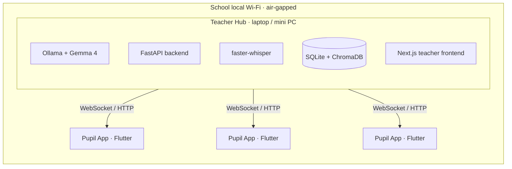

<p align="center">
  
</p>

<h1 align="center">Looplense</h1>

<p align="center">
  <em>A sovereign, offline-first classroom AI that closes the feedback loop between teachers and pupils.</em>
</p>

<p align="center">
  Built for the <strong>Kaggle Gemma 4 Good Hackathon</strong> — targeting the
  <em>Future of Education</em> and <em>Ollama Special Technology</em> tracks.
</p>

---

## Problem

In a busy classroom, pupils who struggle with focus, anxiety, or communication rarely raise their hand the moment they get lost — they go quiet, fall behind, and the lesson moves on without them. Existing AI tutors could help, but they ship pupil voice and learning data to the cloud, which is incompatible with UK and EU school data-protection requirements. Looplense closes that feedback loop with a class helper that lives entirely on the school's local network.

---

## Features

- **Live transcript with tappable terms** — pupils read along in real time; key vocabulary is underlined and explained on tap.
- **Proactive prompt cards** — smart question cards surface dynamically as the teacher speaks, so a pupil can explore a concept without typing.
- **Pupil chat assistant** — a warm, on-topic conversational agent grounded in both the uploaded material and the live audio context.
- **Teacher AI assistant** — an analytical, low-temperature agent for lesson summaries, class analytics, and pupil progress.
- **One-tap quizzes** — the teacher generates a quiz from any key idea, pushes it live, and reviews AI-graded results.
- **Persistent semantic memory** — the helper remembers each pupil's struggles and preferences across sessions.
- **Fully offline & private** — no internet egress, no third-party processors, FERPA / GDPR / COPPA compliant by design.
- **Cross-platform pupil app** — single Flutter codebase for iOS, Android, Web, macOS, Windows, and Linux.
- **Accessibility-first UI** — Lexend typeface and a low-glare palette tuned for neurodivergent learners in bright classrooms.

---

## Architecture

Looplense runs as a **Teacher Hub** (the orchestration node) serving many **Pupil Apps** (thin clients) over the school's local Wi-Fi. All inference, transcription, and storage happen on the hub — pupil devices stay lightweight.



| Layer                | Choice                                                  |
| -------------------- | ------------------------------------------------------- |
| Backend API          | FastAPI (Python), async SQLAlchemy                      |
| Structured store     | SQLite (`backend/data/gemma_edu.db`)                    |
| Vector store         | ChromaDB (`backend/data/chroma/`)                       |
| LLM runtime          | Gemma 4 via Ollama — fully local                        |
| Embeddings           | `nomic-embed-text` via Ollama (768-dim)                 |
| Speech-to-text       | `faster-whisper` (`base.en`) — CPU, no GPU required     |
| Teacher client       | Next.js web app (iPad-browser friendly)                 |
| Pupil client         | Flutter (iOS, Android, Web, macOS, Windows, Linux)      |
| Process orchestrator | `run.py` — boots backend + frontend on the host         |

---

## Setup: The Bypass Orchestrator

To run a 2-billion parameter model on standard school hardware without latency, we explicitly bypassed Docker to preserve 100% of the host machine's RAM and CPU for Gemma 4.

To make testing completely frictionless, **the orchestrator pre-compiles the Flutter Pupil App for the web**. You do not need to set up mobile emulators to test the Edge-Mesh network.

**Prerequisites:**
- Python 3.11+
- Node.js 18+
- Ollama installed and running
- *(macOS users: the setup script will automatically install Flutter via Homebrew if missing)*

### 1. Initial Setup

**Option A — from the zip file:**
```bash
unzip looplense-demo.zip
cd looplense
```

**Option B — clone from GitHub:**
```bash
git clone https://github.com/nickwhitehead01-pixel/loop.git
cd loop
```

**Then, for both options:**
```bash
# Pull the required models to your local machine (first time only)
ollama pull gemma4:e2b
ollama pull nomic-embed-text

# Install dependencies and build the static Pupil App
python3 run.py install
```

### 2. Launch the Ecosystem

```bash
python3 run.py start
```

What `run.py` does:

- Verifies the local environment and ports
- Fires an asynchronous KV-Cache warmup request to Ollama to eliminate cold-start latency
- Boots the FastAPI backend (port 8000)
- Boots the Next.js Teacher Hub (port 3000)
- Serves the pre-compiled Flutter Pupil App via a lightweight static server (port 8080)

| Service | URL |
|---|---|
| 👨‍🏫 Teacher Hub | http://localhost:3000 |
| 🎒 Pupil App | http://localhost:8080 (open in Chrome) |
| ⚙️ Backend API docs | http://localhost:8000/docs |

> **Testing the Pupil App**: Open http://localhost:8080 in Chrome. On the connect screen, enter Hub URL `http://localhost:8000` and Pupil ID `1`.

> **Sample lesson file**: A sample lesson is included at `samples/additional-materials.docx`. Upload it in the Teacher Hub to populate lesson content for testing. 

> **Sample lesson**: Once the document has upload, open a lesson. Select prompt cards and tappable words. Start a transcript and begin reading from the provided course material. You can then begin interacting with the pupil app. Finish the lesson with a quiz.


Press **Ctrl+C** to stop all three services cleanly.


---

## License

[Creative Commons Attribution 4.0 International (CC-BY 4.0)](LICENSE)
